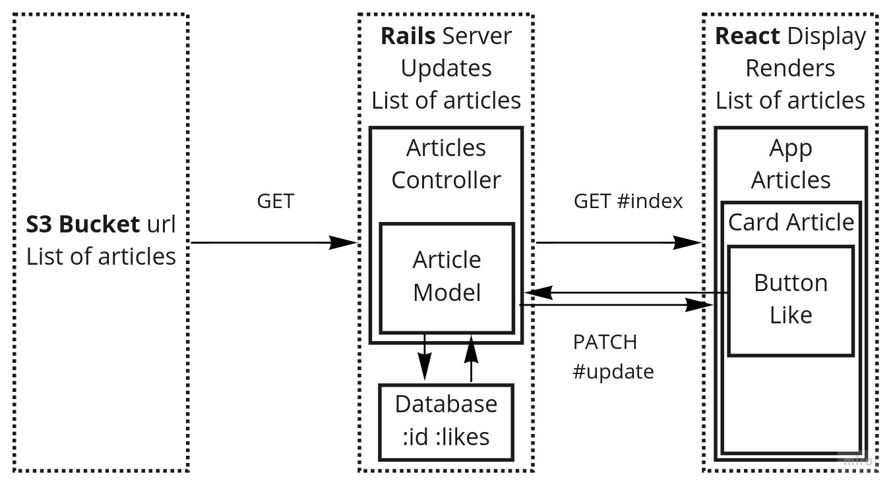

# README

## Sharing App

This app uses Rails and React to pull a list of articles from an S3 bucket, display these articles on the FE and create a db on BE for liking the articles.

### Requirements

- Create a basic rails app (that we could run and try) with a React frontend integrated

- Pull the list of articles from this [link](https://s3-eu-west-1.amazonaws.com/olio-staging-images/developer/test-articles-v3.json), pull this from the server on page load (as it may change)

- Display the list of articles on the page.

- Add the ability to 'like' articles.

  - The data persisted and updated with each new page load.
  - The likes are global and not per user.

_The Likes are global, so it does not require authentication._

### User Stories

- As a global user of the 'Sharing App'

  - So I can visualise all the articles at once

    - I need to read the list of articles with:

      - article picture
      - article title
      - article description
      - owner name
      - owner avatar
      - since when it was was updated

  - So I can show interest in an article

    - I need to be able to click on a 'like' button

  - So I can keep my likes and see the likes from others

    - I need to be able to see the updated number of 'likes'

### Database Schema

There will be one database containing:

- :id, a string, coming from the S3 bucket id.
- :likes, an integer, the number of likes accumulated.

_As the List of Articles is pulled from the server at every page load, only the Id and Likes need to be saved in the database._

### Diagram



#### GET

1 - The list of articles get pulled from AWS to Rails server.

2 - The list of articles get adjusted in the Rails server.

- If the article is found in the database (same Id), it would get the number of likes.

- If the article is not found in the database, it would initialize an instance of Article (with the new Id) with a number of likes equal to 0.

3 - The adjusted list of articles get pulled from Rails server and sent to React, to display the list.

#### PATCH

1 - Through React, every article from the list of articles is displayed in a card which includes a button 'Like'.

2 - When the button is clicked, the specific Article Id is sent to the Rails server through the UPDATE route.

3 - The Rails server updates the database

- If the article is found in the database, it adds one like

- If the article is not found in the database, it creates a new Article with the Article Id and the number of 'likes' set to 1.

4 - The updated number of likes is returned to React.

_The article is saved only if the number of likes is superior than 0 in order to reduce the number of exchanges with the database._

### Articles Controller

index

- pull articles from AWS S3 bucket

  - map through the articles

    - create adjusted_article

    - if the article is found in the DB with 'article id'

      - retrieve the 'likes'

    - else

      - initialize the article with 0 like

  - complete the adjusted_article with the required data

- return all adjusted_articles

update

- if the article is found in the DB with 'article id'

  - increment the mumber of 'likes'

- else

  - create the article with 'likes' = 1

- return updated_article

### Running the app

Get the repo from GitHub

```unix
git clone git@github.com:AdrienFabre/articles-rails-react.git
cd articles-rails-react
```

Install dependencies

```unix
bundle
yarn install
```

Prepare the DB and launch the app

```unix
rake db:create db:migrate
rails s
```

then open: http://localhost:3000/

### Testing

Setup the database

```unix
rake db:create db:migrate
```

#### Rails Server - Rspec

Run Rspec test

```unix
rspec spec --format documentation
```

Results

```unix
Article
  validaton
    id
      must be present
  #complete_article
    returns an object with necessary keys
  #add_like
    returns an article with one more like

Articles Controller
  GET /api/v1/articles
    returns the correct articles keys with new data
    returns the correct articles keys with saved data
  PATCH /api/v1/articles/:id
    returns the updated article

Status requests
  GET /api/v1/articles
    returns status 200
  PATCH /api/v1/articles/:id
    returns a status 200

Finished in 1.45 seconds (files took 1.6 seconds to load)
10 examples, 0 failures

Coverage report generated for RSpec to /home/adrien/Desktop/Rails React Projects/articles-rails-react/coverage. 129 / 129 LOC (100.0%) covered.
```

#### React Frontend - Cypress

Launch the app

```unix
rails s
```

Run Cypress test

```unix
npx cypress run
```

Results

```unix
Running:  home_page_spec.js (1 of 1)

  The Home Page
    ✓ successfully loads (709ms)
    ✓ contains Sharing App
    ✓ contains api response text (489ms)
    ✓ contains the clear image (289ms)
    ✓ contains the blur image (102ms)
    ✓ contains the avatar image (106ms)
    ✓ contains the like button (63ms)

  7 passing (3s)
```

### Recreate the database

```unix
rake db:drop db:create db:migrate
```
